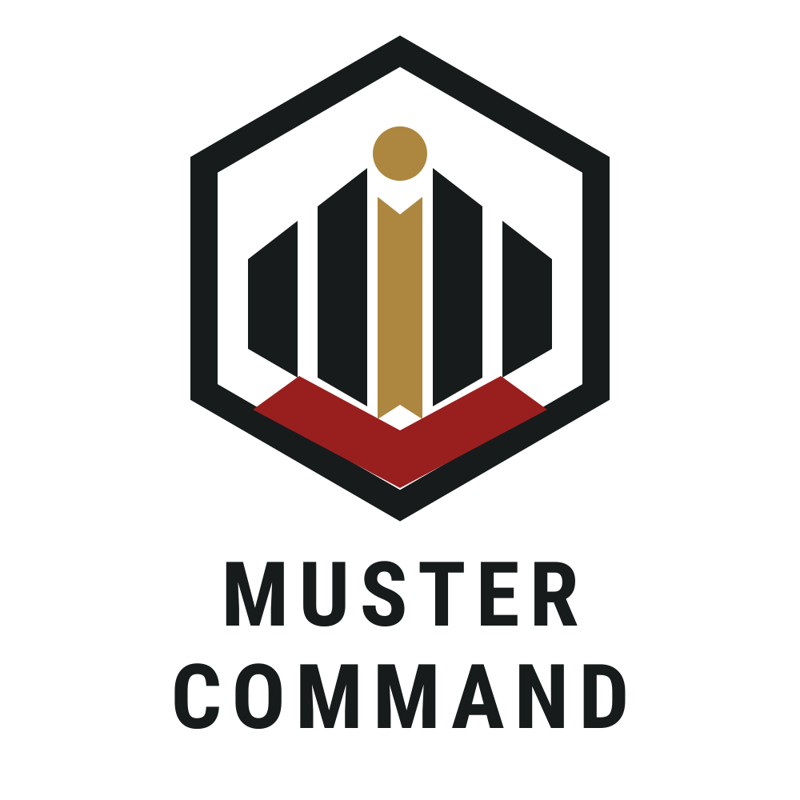

<p align="center">
  
</p>

# Muster Command

Muster Command is a Discord bot and companion web application for gaming communities that run coordinated events. Inspired by large Star Citizen operations, it helps any community organize groups and roles, track attendance, and distribute shared event loot.

**Project status:** Active development · **Version:** 1.0.0<br>
**Official website:** [mustercommand.com](https://mustercommand.com)

## Official project

The official version of Muster Command is maintained by **Web Craft House**. The official website is [https://mustercommand.com](https://mustercommand.com), and the official source repository is [github.com/wch-01/muster-command](https://github.com/wch-01/muster-command).

Third-party forks and independently hosted installations are not necessarily operated, supported, or endorsed by Web Craft House.

## Features

- Structured event creation with reusable server templates
- Multiple fleets, crews, squads, parties, or ground teams per event
- Named roles, slot capacities, extra-participant capacity, and schedule dependencies
- Event signups from Discord buttons or the web application
- Schedule-aware assignment conflict checks
- Attendance reports when an event is closed
- Participant-only loot pools and winner drawings
- Structured resources, weapons, armor, components, consumables, and custom loot
- Automatic 24- or 48-hour loot draws or immediate manual draws
- Per-server administration and Discord role-based command access tiers
- Dedicated-channel or per-event-thread Discord output

## Technology

- TypeScript and Node.js
- Angular and Ionic
- discord.js
- PostgreSQL, Prisma, and Docker Compose

## Requirements

For a local source installation:

- Node.js 22 or newer
- npm
- PostgreSQL 16 or a compatible PostgreSQL server
- A Discord application with a bot user

Docker and Docker Compose are recommended for self-hosting and can also provide the local PostgreSQL database.

## Quick start with Docker Compose

1. Clone the repository and enter it:

   ```bash
   git clone https://github.com/wch-01/muster-command.git
   cd muster-command
   ```

2. Copy the example environment file:

   ```bash
   cp .env.example .env
   ```

   On PowerShell, use `Copy-Item .env.example .env`.

3. Replace every `replace_*` value in `.env`, including `POSTGRES_PASSWORD` and the matching password inside `DATABASE_URL`.

4. Configure the Discord application as described in [Discord setup](#discord-setup).

5. Build and start the application and database:

   ```bash
   docker compose up --build -d
   ```

6. Open [http://localhost:3000/app](http://localhost:3000/app). After Discord login, use [System Admin](http://localhost:3000/app/system-admin) to confirm the public website URL and register slash commands.

View service logs with:

```bash
docker compose logs -f bot
```

## Local development

1. Install dependencies from the lockfile:

   ```bash
   npm ci
   ```

2. Copy `.env.example` to `.env`, replace its placeholders, and ensure `DATABASE_URL` points to a reachable PostgreSQL database.

3. To use the included PostgreSQL container while running Node.js on the host:

   ```bash
   docker compose up -d postgres
   ```

   The database is bound to `127.0.0.1` on `POSTGRES_PORT`, which defaults to `5432`.

4. Generate the Prisma client and initialize the database schema:

   ```bash
   npm run db:generate
   npm run db:push
   ```

   `db:push` is intended for this project's current development and deployment workflow. Review Prisma's output before using it against a database containing important data.

5. Build the Angular application:

   ```bash
   npm run web:build
   ```

6. Start the development server and Discord bot runtime:

   ```bash
   npm run dev
   ```

The web application is available at [http://localhost:3000/app](http://localhost:3000/app). Muster Command currently runs the HTTP server and Discord bot in the same Node.js process. If Discord credentials are absent, the HTTP server starts in an unconfigured state and the bot does not connect.

After source changes, use these checks:

```bash
npm test
npm run lint
npm run build
```

## Configuration

Muster Command loads environment variables through `dotenv`. Keep real values in `.env` or another ignored environment file; never commit credentials.

| Variable | Required | Purpose |
| --- | --- | --- |
| `DISCORD_BOT_TOKEN` | Yes | Discord bot token. `DISCORD_TOKEN` is also accepted as an alias. |
| `APPLICATION_ID` | Yes | Discord application/client ID. `DISCORD_CLIENT_ID` is also accepted as an alias. |
| `DISCORD_CLIENT_SECRET` | Yes | Discord OAuth2 client secret used for website login. |
| `ADMIN_DISCORD_USER_IDS` | Yes | Comma-separated Discord user IDs allowed to use System Admin. |
| `DATABASE_URL` | Yes | PostgreSQL connection URL used by Prisma. |
| `STATE` | No | `development` or `production`; defaults to `production`. |
| `BOT_TIMEZONE` | No | Bot timezone; defaults to `UTC`. |
| `SETUP_HOST` | No | HTTP bind address; defaults to `0.0.0.0`. |
| `SETUP_PORT` | No | HTTP port; defaults to `3000`. |
| `SETTINGS_FILE` | No | Runtime server-settings file; defaults to `./data/settings.json`. |
| `ADMIN_ALLOWED_HOSTS` | No | Comma-separated hostnames allowed to reach System Admin; defaults to local hostnames. |
| `POSTGRES_PASSWORD` | Docker only | Password used by the included PostgreSQL service. |
| `POSTGRES_PORT` | Docker only | Host port for local PostgreSQL access; defaults to `5432`. |

The application stores non-secret server settings in `SETTINGS_FILE`. Discord tokens and the OAuth client secret remain environment-only.

## Discord setup

1. Create or select an application in the [Discord Developer Portal](https://discord.com/developers/applications).
2. On the **Bot** page, create the bot user and copy its token into `DISCORD_BOT_TOKEN`.
3. Enable **Server Members Intent** under **Privileged Gateway Intents**. Muster Command uses the `Guilds` and `GuildMembers` gateway intents.
4. Copy the application ID into `APPLICATION_ID`.
5. On the **OAuth2** page, copy the client secret into `DISCORD_CLIENT_SECRET`.
6. Add the exact OAuth2 callback URL for every environment:

   ```text
   Local:      http://localhost:3000/auth/discord/callback
   Production: https://your-muster-host.example/auth/discord/callback
   ```

   The scheme, hostname, port, and path must match exactly. Do not add a trailing slash or query parameters.

7. Start Muster Command, log in, and open `/app/system-admin`.
8. Save the public website origin without `/app`, then register commands to a test server or globally.
9. Use the application's **Add to Server** link to authorize the bot. Muster Command requests only the channel, message, embed, history, and thread permissions it needs; it does not request Discord Administrator permission.

Global slash-command registration can also be run from the command line:

```bash
npm run commands:deploy
```

The primary command group is `/mc`. See [docs/slash-commands.md](docs/slash-commands.md) for the command reference.

## Production and self-hosting

For a named environment file:

```bash
docker compose --env-file .env.prod up --build -d
```

- Use HTTPS in production.
- Keep the application and PostgreSQL data volumes backed up.
- Put the app behind a reverse proxy and preserve the public `Host`, `X-Forwarded-Host`, and `X-Forwarded-Proto` headers so Discord OAuth generates the correct callback URL.
- Restrict `ADMIN_ALLOWED_HOSTS` to the actual hostnames used to administer the installation.
- Do not expose PostgreSQL publicly. The included Compose mapping binds only to `127.0.0.1`; remove it entirely if host access is unnecessary.
- Treat `.env` files, database backups, and the settings volume as sensitive operational data.
- Independently hosted instances are responsible for their own updates, backups, privacy practices, and support.

If you operate a modified version for users over a network, review the source-offer requirements in section 13 of the AGPL-3.0. The web footer in the official version links to its corresponding source repository.

## Contributing

Bug reports and feature suggestions are welcome. Development of the official Muster Command project is currently handled exclusively by Web Craft House, and unsolicited code contributions are not being accepted at this time. See [CONTRIBUTING.md](CONTRIBUTING.md) for the current policy.

## Security

Do not report security vulnerabilities in a public issue. Follow the private reporting instructions in [SECURITY.md](SECURITY.md).

Repository administrators should enable GitHub secret scanning and push protection, Dependabot alerts and dependency security updates, and code scanning where appropriate.

## License

The Muster Command software source code is licensed under the [GNU Affero General Public License v3.0](LICENSE), identified as `AGPL-3.0-only`.

In plain English, the AGPL permits people to inspect, use, modify, and redistribute the covered source code under its terms. Covered modified versions distributed to others must remain available under the AGPL, and users who interact with a modified network-hosted version must be offered access to its corresponding source as required by section 13.

This summary is not legal advice. If this summary conflicts with the `LICENSE` file, the complete license text controls.

### Trademark

**Muster Command™**, the Muster Command name, logo, iconography, and associated branding are trademarks of Web Craft House.

The GNU Affero General Public License v3.0 applies to the Muster Command software source code, but does not grant permission to use the Muster Command name, logos, or branding to identify modified, redistributed, or independently hosted versions of the software in a manner that suggests they are official, endorsed by, or affiliated with Web Craft House.

Forks and derivative projects should use their own name and branding unless explicit permission has been granted by Web Craft House.

References to “Muster Command” may still be used as reasonably necessary to describe the origin of the software, such as stating that a project is “based on Muster Command.”

## Support Muster Command

Muster Command is free and open source. If you find it useful and would like to support continued development, hosting, and maintenance, you can support Web Craft House on Buy Me a Coffee:

[buymeacoffee.com/webcrafthouse](https://buymeacoffee.com/webcrafthouse)
